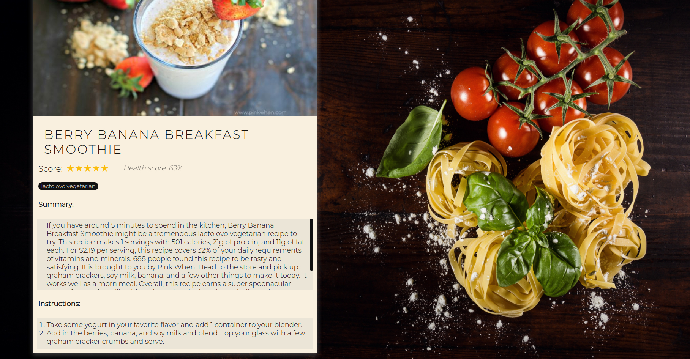
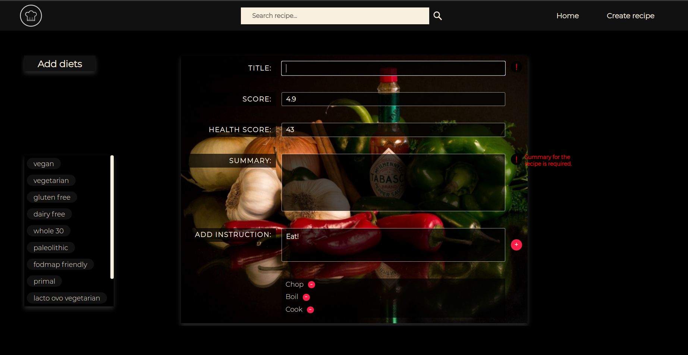

# <a href='https://jralvarezwindey-food-app.vercel.app'> Food App </a>

Website: https://jralvarezwindey-food-app.vercel.app

## About the project

Single page application that allows the user to search food recipes by their
name, order and filter them, create recipes and show their detail. 
The data is fetched from an <a href='https://spoonacular.co'> external API </a>
when using localhost, or read from a data base
when accessing via the <a href='https://jralvarezwindey-food-app.vercel.app/'> public url </a>.
The backend is developed with Node and the syles were achieved using pure CSS.

#### Recipes cards


#### Recipe detail


#### Create recipe


## Technologies used

- JavaScript
- CSS
- HTML 
- React
- Redux
- Node
- Express
- Sequelize
- PostgreSQL

## Getting started (localhost)

In case that you want to run the application locally, here is how you can do it:

- Install PostgreSQL and create a data base called `food` (it cannot be other name!).
  If you don't know how to do any of the previous steps, here are some blogs
  that might help: https://spoonacular.com
- Get an api key from https://spoonacular.com. You have to create an account (it's free!)
- Clone repository in your computer.
- Create a `.env` file in `/server` folder. It must contain the following text:
```
  APIKEY = < your api key >
  DB_USER = < your postgres username >
  DB_PASSWORD = < your postgres password >

  DB_HOST = localhost
```
>(`<` and `>` symbols must be omitted).
- Install NodeJS (version >= 12.18.3) and npm (version >= 6.14.16).
- Execute `npm i` on `/client` and on `/server` folders.
- Execute `npm start` on `/client` folder to initialize backend.
- Execute `npm start` on `/server` folder to initialize frontend.
- Navigate to `http://localhost:3000` in your browser. 
